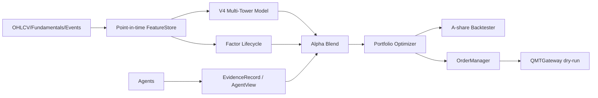

# 生产级 AI Quant Blueprint / Production Blueprint

QuantAgent V4 的生产级蓝图是“研究先行、风控前置、执行后置”。系统先在 synthetic 和 historical point-in-time 数据上验证，再进入 paper trading；默认不会接入 live account。

## 总体架构 / Architecture

## 第一闭环 / First Closed Loop

V4 先跑通 offline synthetic flow：build features、train tiny model、infer alpha、map agent evidence、optimize target weights、run backtest、generate dry-run order intents。

## 输入输出 / Inputs and Outputs

输入包括 OHLCV、fundamentals with announcement time、structured events、fund flow、universe snapshots。输出包括 feature panel、labels、model metadata、AgentView、target weights、backtest report、dry-run audit logs。

## 安全约束 / Safety

所有 real broker 行为都在 `execution/` 边界之后。默认 `dry_run=true`，并要求 kill switch、risk gate、reconciliation。
