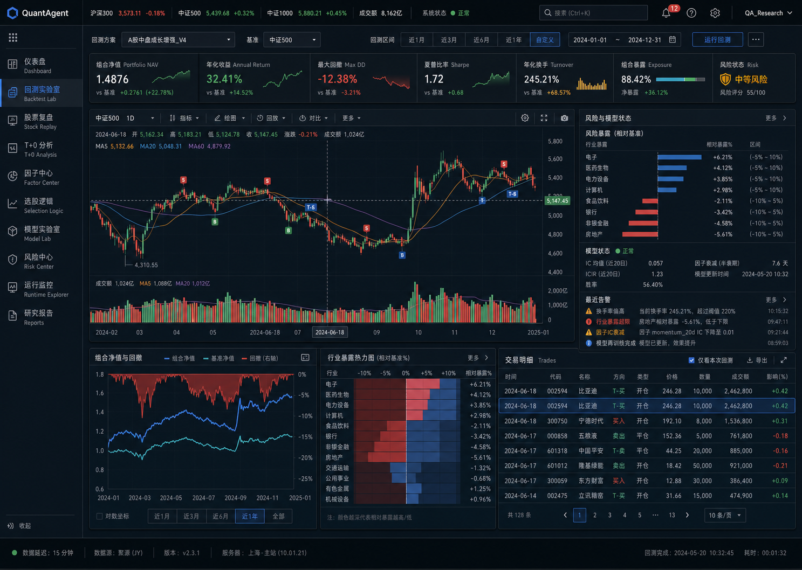
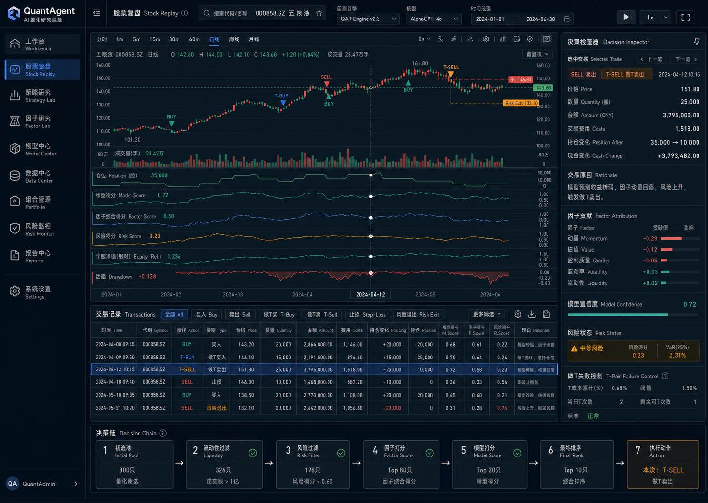
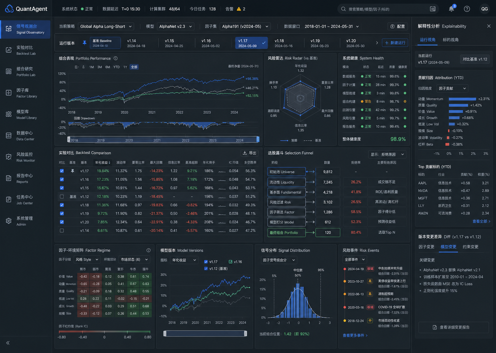

# Quant UI 视觉方向 / Visual Directions

三个概念均基于 1440 × 1024 desktop terminal，遵守深色、克制、高数据密度、无廉价渐变、无大面积荧光色的约束。

## 1. Institutional Command Grid

- 强项：Dashboard、组合状态、风险和交易 blotter 的全局密度。
- 适用：作为系统首页和 portfolio command center。

## 2. Research Workbench

- 强项：Stock Replay、K 线与交易表联动、Decision Inspector、做 T 和决策链。
- 适用：本项目最关键的研究复盘 workflow。
- 当前推荐方向。

## 3. Signal Observatory

- 强项：实验对比、Selection Funnel、factor-regime、model version 和 risk observability。
- 适用：Backtest Lab、Selection Logic 和 Model Lab。

## Selection gate

React implementation 需要选择一个主要方向。其他方向仍可作为对应页面的 secondary reference：

- 选 1：整体偏 command center。
- 选 2：整体偏 stock replay research workbench。
- 选 3：整体偏 experiment observability。

