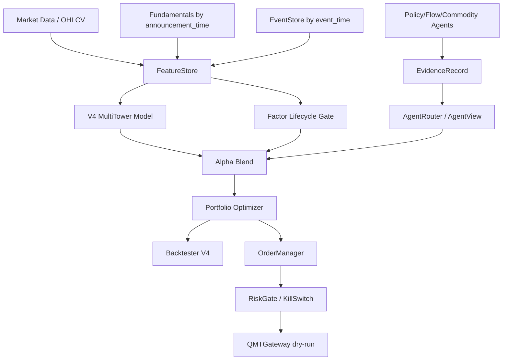

# V4 架构 / Architecture

QuantAgent V4 是面向大 A 市场的 AI Quant OS。它把数据、模型、Agent evidence、组合优化、回测和执行准备分层，确保 research 与 execution boundary 清晰。

## 架构图 / System Diagram



## 安全原则 / Safety Principles

Agent never orders，Optimizer never orders，QMT dry-run by default。所有 live trading 必须显式配置并通过 kill switch 与 reconciliation。

## Synthetic Flow / 离线闭环

```powershell
quantagent build-features-v4
quantagent infer-v4
quantagent build-portfolio-v4
quantagent backtest-v4
quantagent paper-trade-v4 --dry-run
```
